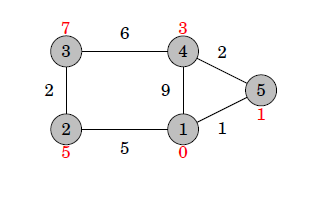

<h1>
INTRODUCTION-
</h1>

In this project we will be using Dijkstra’s Algorithm to find the shortest path between two destination which will be used for flight bookings. The program will first allow the user to create a graph by taking inputs, then the program will display the list of city. The user can then input a departure and destination city. Then the program will find shortest path between the two destinations using Dijkstra’s shortest path algorithm. Then the shortest path and its relative prices will be printed.

<h2>
List of Data Structures used-
</h2>

•	Graphs

•	Priority queue

•	Hashing (unoredered_map container of STL which uses hashing)

•	Dynamic arrays (vectors)

•	Pairs
<h2>
Dijkstra’s algorithm-
  </h2>

Dijkstra’s algorithm finds shortest paths from the starting node to all nodes of the graph. The benefit of Dijkstra’s algorithm is that it is more efficient and can be used for processing large graphs. 

However, the algorithm requires that there are no negative weight edges in the graph. Dijkstra’s algorithm maintains distances to the nodes and reduces them during the search. Dijkstra’s algorithm is efficient, because it only processes each edge in the graph once, using the fact that there are no negative edges.

  

<h3>
Example-</h3>

Let us consider how Dijkstra’s algorithm works in the following graph when the
starting node is node 1:

  

Initially the distance to the starting node is
0 and the distance to all other nodes is infinite.
At each step, Dijkstra’s algorithm selects a node that has not been processed yet and whose distance is as small as possible. The first such node is node 1 with
distance 0.
                   
When a node is selected, the algorithm goes through all edges that start at the node and reduces the distances using them:

  

                        
In this case, the edges from node 1 reduced the distances of nodes 2, 4 and 5,
whose distances are now 5, 9 and 1.

The next node to be processed is node 5 with distance 1. This reduces the distance to node 4 from 9 to 3:

  

                          
After this, the next node is node 4, which reduces the  distance to node 3 to 9:

    

  

A remarkable property in Dijkstra’s algorithm is that whenever a node is selected, its distance is final. For example, at this point of the algorithm, the distances 0, 1 and 3 are the final distances to nodes 1, 5 and 4.

After this, the algorithm processes the two remaining nodes, and the final distances are as follows:

  

<h2>
IMPLEMENTATION-</h2>

The following implementation of Dijkstra’s algorithm calculates the minimum distances from a node x to other nodes of the graph. The graph is stored as adjacency lists so that adj[a] contains a pair (b,w) always when there is an edge from node a to node b with weight w.

An efficient implementation of Dijkstra’s algorithm requires that it is possible to efficiently find the minimum distance node that has not been processed. An appropriate data structure for this is a priority queue that contains the nodes ordered by their distances. Using a priority queue, the next node to be processed can be retrieved in logarithmic time.

In the following code, the priority queue q contains pairs of the form (-d, x), meaning that the current distance to node x is d. The array distance contains the distance to each node, and the array processed indicates whether a node has been processed. Initially the distance is 0 to x and 1 to all other nodes.	

Note that the priority queue contains negative distances to nodes. The reason for this is that the default version of the C++ priority queue finds maximum elements, while we want to find minimum elements. By using negative distances, we can directly use the default priority queue.

  

 
<h2>
Time Complexity-</h2>
  
<b>O(n + m log(m) )</b>

n: number of vertices

m: number of edges

<h2>
Flow Chart: </h2>

1)The user is first asked to create a graph by entering name of two cities and distance between them.

2)When the user has finished creating graph he can enter 0 to continue.

3)Then the user is presented a list of cities present in the graph.

4)The user is then asked to enter the departure and destination city.

5)The shortest path between these two cities is calculated using Dijkstra’s algorithm.

6)Then price to cover this shortest distance is calculated and the resulting price is printed as an output.

<h2>
Implementation details and Results:</h2>

Class for Graph:

We have defined a class for creating an undirected graph which has following :

A) Private members:

1)unordered_map<string,vector<pair<string,int>>> g :

This map (which is based on hashing) would be used as an adjacency list in which key is the city1 name and values are vector of pairs which contain city2 and its distance from city1 .

B) Public members:

1) void addEdge(string start,string end,int wt) :

This member function takes name of two city and distance between them as arguments and inserts them into the graph.

2) int ShortestPath(string dep,string des) :

This member function is the function that implements Dijkstra’s algorithm. It takes departure city and destination city as input and calculates the shortest path between them using Dijkstra’s algorithm. 

3) void Display():

This function displays the list of cities present in the graph.

4) int Price():

This function returns the cost of distance.

